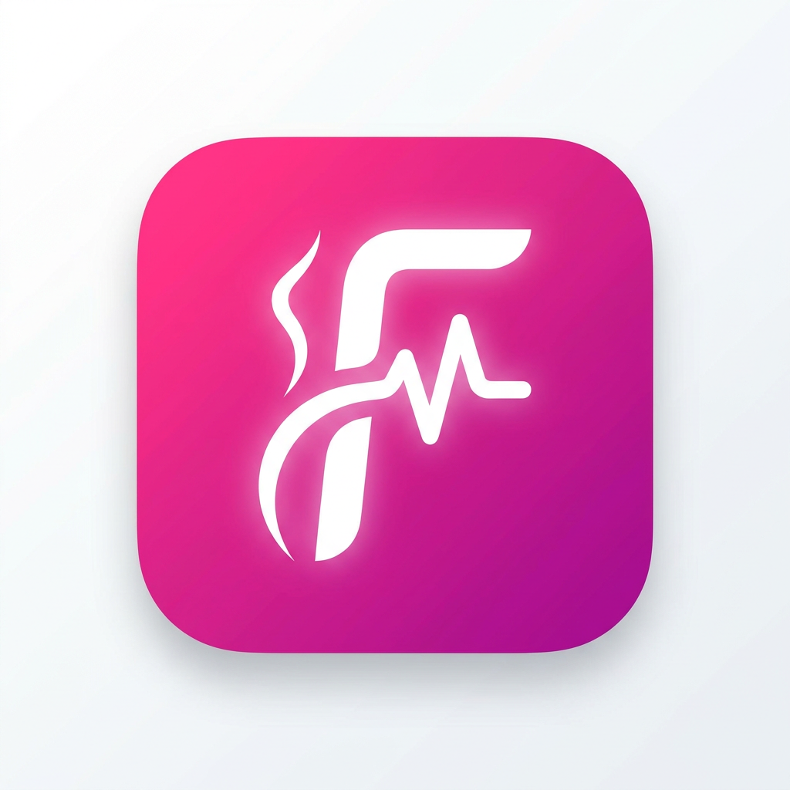

# FitMe

AI-powered, highly customizable health & fitness coaching for **iOS, Android & Web** — one Flutter codebase. Practical like WHOOP: not just an exercise list, but a coach that reads your real health data, your meals, and your goals.

**🌐 Live (web):** https://mujtabatariq18.github.io/fitme/ — auto-deploys from `main` via GitHub Actions. Works in mobile browsers too.



## Vision

- **AI coaching** — body-area analysis from photos, calorie/macro estimation from a food photo, adaptive workouts. Providers are **pluggable**: configure any number of vendors (Claude, OpenAI, Gemini, Groq, OpenRouter, custom) in the admin panel and route each AI task to whichever model you want.
- **Animated avatars** — gender-aware visual exercise guidance.
- **Health integration** — Apple Health / Google Fit / Samsung Health & wearables.
- **Proactive** — continuous stat monitoring with push-notification nudges.
- **Personalized nutrition** — calorie targets & macros computed from your body and goals.

## Tech stack

| Concern | Choice |
|---|---|
| UI / cross-platform | Flutter 3.44 (Dart 3.12) — iOS, Android, Web |
| State | Riverpod (`Notifier`) |
| Routing | go_router (gated by onboarding completion) |
| Backend (phase 2) | Supabase — auth, Postgres, storage, edge functions (hold AI keys server-side) |
| AI | Pluggable multi-vendor, admin-routed per task |
| Charts / type | fl_chart · Sora + Inter |

## Architecture

```
lib/
├── core/
│   ├── theme/        # design tokens: colors (+ FitColors ThemeExtension),
│   │                 # gradients, spacing, shadows, typography, theme
│   ├── widgets/      # PrimaryButton, FitCard, MetricRing, SelectionTile,
│   │                 # BlobBackground, FitMe logo (vector + image)
│   ├── router/       # app_router.dart (GoRouter + onboarding gate)
│   └── services/     # LocalStore (SharedPreferences wrapper)
└── features/
    ├── onboarding/   # domain/UserProfile (BMR/TDEE/macros) · profile_controller
    │                 # presentation: welcome → 7-step flow → plan-ready summary
    ├── dashboard/    # AppShell (bottom nav) + HomeScreen (calorie ring, macros)
    ├── admin/        # domain/AiConfig · ai_config_controller
    │                 # presentation/AiSettingsScreen (providers + task routing)
    └── settings/     # SettingsScreen (entry to admin AI panel)
```

### Design system

`context.fit` exposes brightness-aware semantic tokens (`surface`, `textPrimary`…)
via a `ThemeExtension`. Brand colors are constant; surfaces adapt for light/dark.
Both themes are implemented.

### AI provider model (the "dynamic admin setting")

`AiConfig` holds a list of `AiProvider`s (vendor + key + model + base URL) and a
`taskBindings` map routing each `AiTask` (foodVision, bodyAnalysis,
workoutSuggestion, mealPlanning, chatCoach, nutritionLookup) to a provider.
Vision-only tasks are restricted to vision-capable vendors in the UI.

> **Security:** API keys are stored locally only for admin preview. In
> production they live in Supabase edge-function secrets and are never shipped
> to the client. See the note on `AiProvider.toMap`.

## Run

```bash
flutter pub get
flutter run                 # device/emulator
flutter run -d chrome       # web
flutter test                # unit + widget tests
dart run flutter_launcher_icons   # regenerate icons from assets/brand/logo_a.png
```

## Run locally with Docker

```bash
docker compose up -d --build      # serves the web app at http://localhost:8080
```
The admin panel is in-app: log in as admin → Settings → AI Settings
(`http://localhost:8080/#/settings/ai`).

## Run on an Android emulator

The Windows JDK has an AF_UNIX/loopback bug that breaks the local Gradle daemon,
so the APK is built inside a Linux Flutter container, then installed via adb:
```bash
docker run --rm -v "E:/FItMe:/app" -v fitme_gradle:/root/.gradle -v fitme_android:/root/.android -w /app \
  ghcr.io/cirruslabs/flutter:3.44.0 \
  bash -lc "git config --global --add safe.directory /app && flutter pub get && flutter build apk --debug"
adb install -r build/app/outputs/flutter-apk/app-debug.apk
```
> After a container build, run `flutter pub get` on the host once to restore the
> Windows `.dart_tool` package config (the bind mount leaves Linux paths).

## Accounts (local/offline auth)

| Role | Email | Password |
|---|---|---|
| Admin | `admin@fitme.app` | `admin123` |
| Member | `demo@fitme.app` | `demo123` |

Sign-up creates new member accounts. Admins get the AI Settings + User
Management panels. (Local credential store now; swaps to Supabase auth in the
backend phase.)

## Status

**Phase 1 — Foundation (done):** scaffold, design system (light+dark), logo +
launcher icons, onboarding with BMR/TDEE/macro math, dashboard, routing,
persistence. Live on web.

**Phase 2 — Auth + all modules (done):**
- Auth: login/signup, role-based routing, seeded admin & member, user management.
- Meal plan: 72 meals across 6 diets, recipe detail, diet switcher.
- Workouts: 14 routines / 84 exercises with form cues, area filter, detail view.
- Food log: 62-food database, serving logging, live ring vs target, scan entry point.
- Progress: weight chart + logging.
- AI coach: 40 tips + 12 Q&A, offline answering, live when a provider is bound.
- Admin AI panel: OpenRouter (+per-vendor) model picker with vision badges &
  context sizes; vision-only tasks restricted to vision models.

**Phase 3 — Live AI + remaining modules (done):**
- **Live AI client** — multi-vendor HTTP (OpenAI-compatible / Anthropic / Gemini)
  with vision. The coach chat and the food-photo scan call the bound provider
  (offline fallback if none). Keys come from the admin AI panel.
- **Guided workout player** — gender-aware animated avatar, set/rest timers,
  progress, completion summary.
- **Reminders** — local notifications for meals / workout / water + settings.
- **Health sync** — Health Connect / HealthKit service + dashboard card.
- **Supabase backend layer** — guarded init, `supabase/schema.sql` (RLS),
  `supabase/functions/ai-proxy` edge function, `docs/BACKEND.md`. Activates with
  `--dart-define SUPABASE_URL=… SUPABASE_ANON_KEY=…`.

## Testing in Android Studio (Windows)

> **Heads-up:** this machine's JDK hits a Windows AF_UNIX/loopback bug
> (`java.io.IOException: Unable to establish loopback connection`). It affects
> **any** local Gradle invocation — including Android Studio's Gradle sync —
> not just the Flutter CLI. If AS fails to sync/build with that error, try, in
> order:
> 1. **Antivirus/Defender exclusion** for the project folder, `%USERPROFILE%\.gradle`, and the JDK folder (security software intercepting AF_UNIX loopback is the most common cause).
> 2. `netsh winsock reset` in an **admin** PowerShell, then reboot (repairs a corrupted Winsock that breaks AF_UNIX loopback).
> 3. Android Studio → Settings → Build → Build Tools → Gradle → set **Gradle JDK** to the embedded **jbr**.
>
> If Gradle still won't run locally, use the container-built APK:
> `docker run --rm -v "E:/FItMe:/app" -v fitme_gradle:/root/.gradle -v fitme_android:/root/.android -w /app ghcr.io/cirruslabs/flutter:3.44.0 bash -lc "flutter pub get && flutter build apk --debug"`
> then in Android Studio just select the running emulator and **Run** the
> installed app, or `adb install -r build/app/outputs/flutter-apk/app-debug.apk`.

## Roadmap (next)

- Wire profile/log **sync to Supabase** once a project is connected.
- **Body-area progress photos** → vision analysis & comparison over time.
- **FCM/APNs** push (server-driven) on top of the local reminders.
- Real **signing config** + Play/App Store submission.
